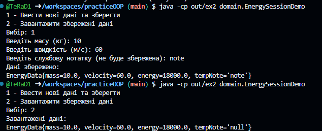
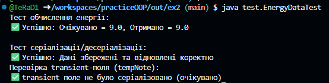
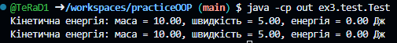

# Практика ООП
## Завдання 2
### Список завданнь:
- Розробити клас, що серіалізується, для зберігання параметрів і результатів обчислень. Використовуючи агрегування, розробити клас для знаходження рішення задачі. 
- Розробити клас для демонстрації в діалоговому режимі збереження та відновлення стану об'єкта, використовуючи серіалізацію. Показати особливості використання transient полів. 
- Розробити клас для тестування коректності результатів обчислень та серіалізації/десеріалізації. Використовувати докладні коментарі для автоматичної генерації документації засобами javadoc.
- <b>Знайти двійкове уявлення цілої частини значення кінетичної енергії
фізичного тіла при заданих значеннях маси та швидкості.</b>

### Результат
<b>Файли знаходяться в src/ex2, документація docs/ex2</b>

#### Тестування класу EnergySessionDemo

#### Тестування класу EnergyDataTest

## Завдання 3
### Список завданнь:
- Як основа використовувати вихідний текст проекту попередньої лабораторної роботи. Забезпечити розміщення результатів обчислень у колекції з можливістю збереження/відновлення.
- Використовуючи шаблон проектування Factory Method (Virtual Constructor), розробити ієрархію, що передбачає розширення рахунок додавання нових відображуваних класів.
- Розширити ієрархію інтерфейсом "фабрикованих" об'єктів, що представляє набір методів для відображення результатів обчислень.
- Реалізувати ці методи виведення результатів у текстовому вигляді.
- Розробити тареалізувати інтерфейс для "фабрикуючого" методу.

### Результат
<b>Файли знаходяться в src/ex3, документація docs/ex3</b>

#### Тестування розроблених методів класом Test
