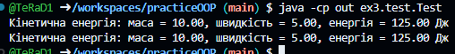
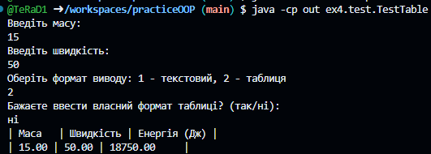
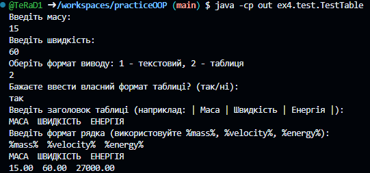
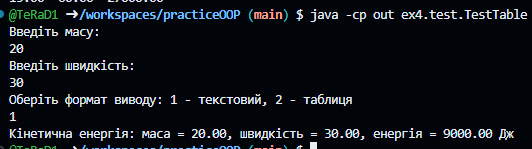
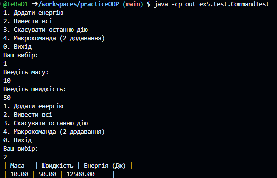
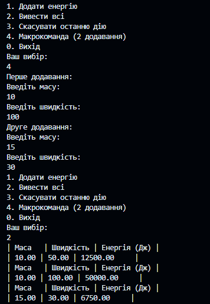
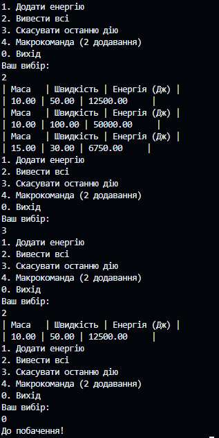
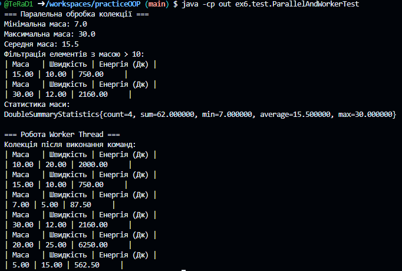

# Практика ООП
## Завдання 2
### Список завданнь:
- Розробити клас, що серіалізується, для зберігання параметрів і результатів обчислень. Використовуючи агрегування, розробити клас для знаходження рішення задачі. 
- Розробити клас для демонстрації в діалоговому режимі збереження та відновлення стану об'єкта, використовуючи серіалізацію. Показати особливості використання transient полів. 
- Розробити клас для тестування коректності результатів обчислень та серіалізації/десеріалізації. Використовувати докладні коментарі для автоматичної генерації документації засобами javadoc.
- <b>Знайти двійкове уявлення цілої частини значення кінетичної енергії
фізичного тіла при заданих значеннях маси та швидкості.</b>

### Результат
<b>Файли знаходяться в src/ex2, документація docs/ex2</b>

#### Тестування класу EnergySessionDemo

#### Тестування класу EnergyDataTest

----
## Завдання 3
### Список завданнь:
- Як основа використовувати вихідний текст проекту попередньої лабораторної роботи. Забезпечити розміщення результатів обчислень у колекції з можливістю збереження/відновлення.
- Використовуючи шаблон проектування Factory Method (Virtual Constructor), розробити ієрархію, що передбачає розширення рахунок додавання нових відображуваних класів.
- Розширити ієрархію інтерфейсом "фабрикованих" об'єктів, що представляє набір методів для відображення результатів обчислень.
- Реалізувати ці методи виведення результатів у текстовому вигляді.
- Розробити тареалізувати інтерфейс для "фабрикуючого" методу.

### Результат
<b>Файли знаходяться в src/ex3, документація docs/ex3</b>

#### Тестування розроблених методів класом Test

----
## Завдання 4
### Список завданнь:
- За основу використовувати вихідний текст проекту попередньої лабораторної роботи Використовуючи шаблон проектування Factory Method (Virtual Constructor), розширити ієрархію похідними класами, реалізують методи для подання результатів у вигляді текстової таблиці. Параметри відображення таблиці мають визначатися користувачем.
- Продемонструвати заміщення (перевизначення, overriding), поєднання (перевантаження, overloading), динамічне призначення методів (Пізнє зв'язування, поліморфізм, dynamic method dispatch).
- Забезпечити діалоговий інтерфейс із користувачем.
- Розробити клас для тестування основної функціональності.
- Використати коментарі для автоматичної генерації документації засобами javadoc.

### Результат
<b>Файли знаходяться в src/ex4, документація docs/ex4</b>

#### Тестування розроблених методів класом TestTable
 
<b>Використання таблиці за замовчуванням</b> 
 
<b>Використання таблиці з форматом користувача</b> 
 
<b>Використання формату рядка</b> 

----
## Завдання 5
### Список завданнь:
- Реалізувати можливість скасування (undo) операцій (команд).
- Продемонструвати поняття "макрокоманда".
- При розробці програми використовувати шаблон Singletone.
- Забезпечити діалоговий інтерфейс із користувачем.
- Розробити клас для тестування функціональності програми.
### Результат
<b>Файли знаходяться в src/ex5, документація docs/ex5</b>

#### Тестування розроблених методів класом CommandTest
 
<b>Додавання даних, вивід даних</b> 
 
<b>Макрокоманда, вивід даних</b> 
 
<b>Скасування дії, вивід даних</b> 

----
## Завдання 6
### Список завданнь:
- Продемонструвати можливість паралельної обробки елементів колекції (пошук мінімуму, максимуму, обчислення середнього значення, відбір за критерієм, статистична обробка тощо).
- Управління чергою завдань (команд) реалізувати за допомогою шаблону Worker Thread.
### Результат
<b>Файли знаходяться в src/ex6, документація docs/ex6</b>

#### Тестування розроблених методів класом ParallelAndWorkerTest
